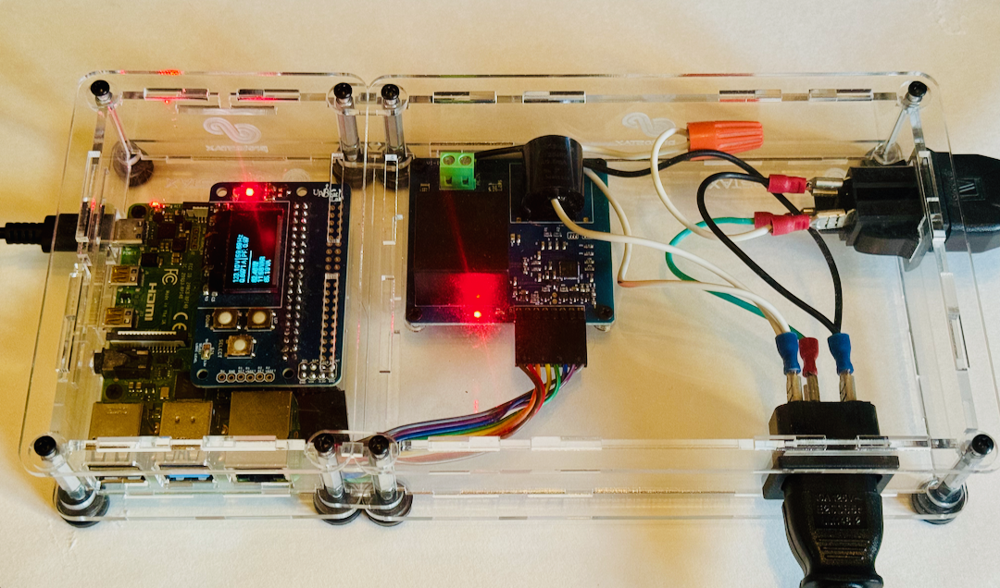
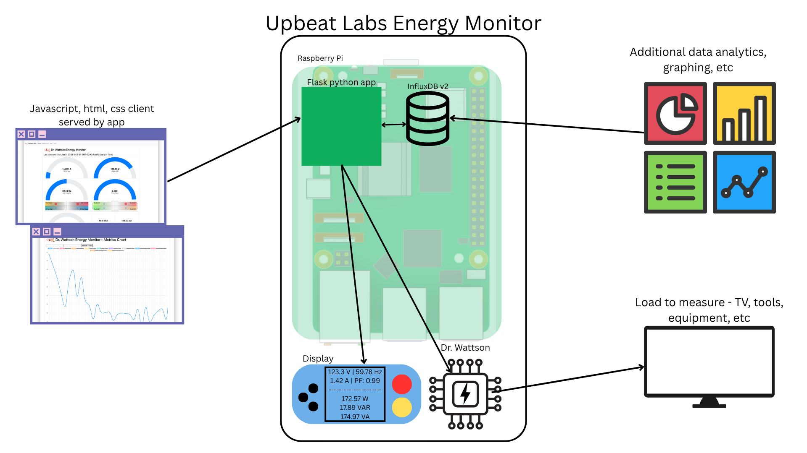

# UpbeatLabs_EnergyMonitor
Upbeat Labs EnergyMonitor

The Upbeat Labs Energy Monitor is an energy monitoring and analysis device. It measures the AC energy parameters of any connected device, like RMS Voltage, Current, Line Frequency, Power Factor, Active/Reactive/Apparent Power etc, logs it to a time-series database, and also exposes the current metrics and historical data charts via a web-app. 

It has been created using a Raspberry Pi 4, Dr. Wattson Energy Monitoring Board V2, OLED screen, ProtoStax Enclosure for Raspberry Pi 3/4/5 and ProtoStax Enclosure for Dr. Wattson Energy Monitor. 

The ProtoStax Enclosure for Raspberry Pi 3/4/5 can be connected to the ProtoStax Enclosure for Dr. Wattson Energy Monitor to form a composite enclosure that holds everything together, including a power inlet and an outlet whose energy consumption parameters can be measured. 

The finished project looks like this: 




The Raspberry Pi runs a python Flask based app that queried Dr. Wattson every second and uploads the data to an InfluxDB instance. The python Flask app also presents a client user interface using HTML, CSS and Javascript to display the current energy metrics in a dashboard. You can also view historical data - last 5 mins, 10 mins, 30 mins, 60 mins, 3h, 6h, 12h and 24h. 

This infrastructure also enables any additional data analysis and control to be built on top of it easily. 

Here is the architecture diagram. 




## Prerequisites

[Dr. Wattson Energy Monitoring Board V2](https://www.protostax.com/products/dr-wattson-energy-monitoring-board-v2)
[ProtoStax Enclosure for Dr. Wattson Energy Monitor](https://www.protostax.com/products/protostax-enclosure-for-dr-wattson-energy-monitor)
Raspberry Pi (using a Raspberry Pi 4B here) running bookworm
[ProtoStax Enclosure for Raspberry Pi 5 / 4 / 3 Model B/B+](https://www.protostax.com/products/protostax-for-raspberry-pi-b)
[ProtoStax Horizontal Stacking Kit](https://www.protostax.com/products/protostax-horizontal-stacking-kit)
OLED screen

InfluxDB2 database installed and running

## Installing

```
git clone https://github.com/upbeatlabs/UpbeatLabs_EnergyMonitor.git
cd UpbeatLabs_EnergyMonitor
python -m venv venv
source venv/bin/activate
pip install -r requirements.txt
```

## Usage

```
cd UpbeatLabs_EnergyMonitor
venv/bin/python app.py
```

Or you can install and run it as a service (starts up automatically when the Raspberry Pi boots up)

## Running it as a service

The Python script can be started during boot by creating a service - more info at https://www.raspberrypi.org/documentation/linux/usage/systemd.md

1. Edit upbeatlabs_energymonitor.service - adjust the **WorkingDirectory** path
according to where you've installed it:

```
WorkingDirectory=/home/pi/UpbeatLabs_EnergyMonitor
```

2. Copy the upbeatlabs_energymonitor.service file into /etc/systemd/system as root:

```
sudo cp upbeatlabs_energymonitor.service /etc/systemd/system/
```

3. Start the service:
```
sudo systemctl start upbeatlabs_energymonitor.service
```

4. Check if the service is running:

```
sudo systemctl status upbeatlabs_energymonitor.service
```

The output should be similar to:

```
● upbeatlabs_energymonitor.service - Upbeat Labs Energy Monitor
     Loaded: loaded (/etc/systemd/system/upbeatlabs_energymonitor.service; disabled; preset: enabled)
     Active: active (running) since Sat 2025-05-31 14:10:16 PDT; 3s ago
   Main PID: 137552 (python)
      Tasks: 6 (limit: 460)
        CPU: 1.276s
     CGroup: /system.slice/upbeatlabs_energymonitor.service
             └─137552 /home/pi/UpbeatLabs_EnergyMonitor/venv/bin/python app.py

May 31 14:10:18 pi4 python[137552]: voltageSagLimit = 800, voltageSurgeLimit = 1300, overCurrentLimit = 1800, overPowerLimit = 1600
May 31 14:10:18 pi4 python[137552]: Event Config Register set to 983040
May 31 14:10:18 pi4 python[137552]: Energy Accumulation has already been reset today.
May 31 14:10:18 pi4 python[137552]:  * Serving Flask app 'app'
May 31 14:10:18 pi4 python[137552]:  * Debug mode: on
May 31 14:10:18 pi4 python[137552]: WARNING: This is a development server. Do not use it in a production deployment. Use a production WSGI server instead.
May 31 14:10:18 pi4 python[137552]:  * Running on all addresses (0.0.0.0)
May 31 14:10:18 pi4 python[137552]:  * Running on http://127.0.0.1:5000
May 31 14:10:18 pi4 python[137552]:  * Running on http://10.0.0.232:5000
May 31 14:10:18 pi4 python[137552]: Press CTRL+C to quit
```

5. If the service is running fine, you can enable it and reboot the Raspberry Pi to load it automatically during boot:
```
sudo systemctl enable upbeatlabs_energymonitor.service
```

6. To stop the service:
```
sudo systemctl stop upbeatlabs_energymonitor.service
```

## License

Written by Sridhar Rajagopal for Upbeat Labs. BSD license, all text above must be included in any redistribution

A lot of time and effort has gone into providing this and other code. Please support UpbeatLabs/ProtoStax by purchasing products from us!


## Disclaimer

Dr. Wattson is designed to be safe with built-in isolation using current and voltage
transformers, and also has an optional enclosure available to shield you from high voltages.
You will, however, still need to do the wiring for your particular application. Please use
common sense and caution, and if necessary, please get help from someone knowledgable
and qualified!

Incorrect or improper handling could result in:
• Serious injuries or death
• Physical damage of the product
• Creating dangerous hazards

Upbeat Labs cannot be held liable or responsible, and will not
accept any type of liability in any event, in case of injury or even death by building and/or
using or misusing this information. By accessing, reading, and/or printing the instructions
presented here, you agree to be solely responsible as stated in the above disclaimer and
exempt Upbeat Labs from any criminal and/or liability suit.
Safety is a primary concern with high voltage circuits! Do not attempt unless you know what
you are doing and take the necessary precautions!